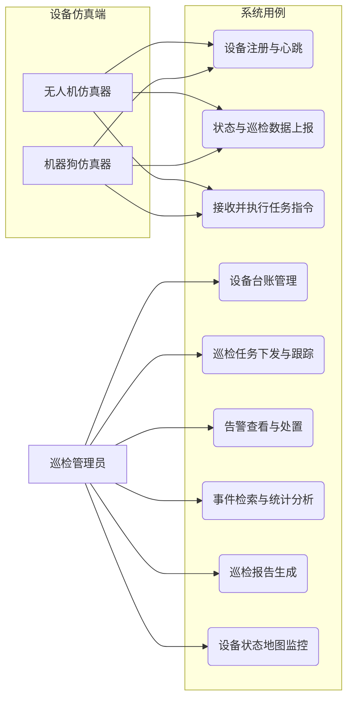
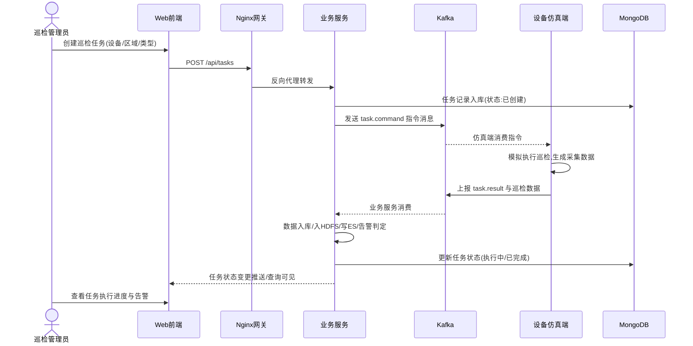
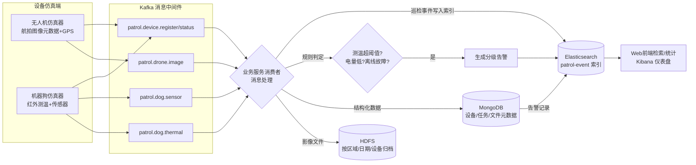
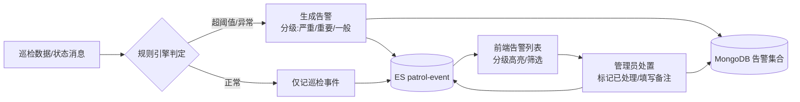

# 电力场站设备巡检数据集成平台 —— 需求分析文档

> 项目:无人机机器狗空地协同巡检集成平台(选题 2:电力场站设备巡检数据集成平台·进阶)
> 阶段:阶段一(需求分析与方案设计)产出物 2/3
> 版本:v1.0 初稿 | 日期:2026-09-11

---

## 1 引言

### 1.1 编写目的

本文档描述电力场站设备巡检数据集成平台的功能性需求、非功能性需求、业务流程与验收标准,作为后续系统架构设计、详细设计、编码实现与测试验收的依据。文档结构与《企业应用开发实践课程设计报告》第 3 章"系统需求分析"保持一致,阶段三可直接整合入报告。

### 1.2 项目范围

本项目为软件集成仿真开发实践,覆盖以下范围:

- **包含**:无人机/机器狗设备仿真、Kafka 消息流转、HDFS 影像存储、MongoDB 结构化数据存储、Elasticsearch 检索分析、Kibana 可视化、Nginx 网关、Web 可视化前端、巡检报告输出、系统测试;
- **不包含**:实体无人机/机器狗硬件、真实航拍/测温数据采集、商用级权限体系与多租户架构(权限认证为选做加分项)。

### 1.3 术语定义

| 术语 | 说明 |
| --- | --- |
| 设备仿真端 | 运行在平台侧的软件模块,模拟无人机/机器狗的行为:注册、心跳、状态、数据上报、指令执行 |
| 巡检任务 | 平台下发给设备执行的一次巡检作业,如"3 号杆塔可见光+红外航拍""2 号变压器红外测温" |
| 巡检事件 | 设备上报的每一次数据记录(图像元数据、测温、传感器读数)及其在 ES 中的索引文档 |
| 告警 | 巡检数据触发规则(测温超阈值、电量低、设备离线/故障)产生的事件,分等级管理 |
| 指令消息 | 平台通过 Kafka 下发给设备仿真端的任务指令消息 |

## 2 业务场景描述

电力场站(变电站/光伏场站)设备长期运行于户外环境,存在杆塔金具松动锈蚀、光伏板热斑、变压器局部过热、开关柜触点发热等隐患。传统人工巡检效率低、盲区多、无法回溯历史数据。本平台模拟"**无人机高空广域巡查 + 机器狗地面抵近复核**"的协同巡检业务:

1. **巡查(发现)**:巡检管理员创建巡检任务并下发;无人机仿真器模拟沿航线飞行,高空拍摄杆塔、光伏板,回传航拍图像元数据与 GPS 位置;
2. **复核(确认)**:机器狗仿真器模拟抵达地面设备区,对变压器、开关柜、逆变器等设备进行近距离红外测温与环境传感器采集,回传测温数据、运行状态;
3. **告警(处置)**:平台对上报数据做规则判定(如测温超过阈值),生成分级告警;巡检管理员查看告警详情并处置;
4. **归档(分析)**:巡检影像入 HDFS 归档,结构化数据入 MongoDB,巡检事件与告警写入 Elasticsearch;支持按设备、时间、告警类型、地理位置检索,多维统计,输出巡检报告。

业务规则:

- 测温告警阈值:变压器热点 >80℃(严重)、60~80℃(一般),具体阈值可配置;
- 心跳周期 5s,连续 3 个周期未收到心跳判定设备离线并产生告警;
- 电量 <20% 产生低电量告警;设备故障状态立即产生故障告警;
- 告警等级:严重(CRITICAL)/重要(MAJOR)/一般(MINOR)。

## 3 功能性需求

### 3.1 设备仿真接入需求(FR1)

| 编号 | 需求描述 | 优先级 |
| --- | --- | --- |
| FR1-1 | 无人机/机器狗仿真器启动后向平台注册设备(编号、型号、类型、所属区域) | 高 |
| FR1-2 | 仿真器按周期(5s)上报心跳,平台更新设备在线状态与最近心跳时间 | 高 |
| FR1-3 | 仿真器上报设备状态:在线/离线、电量、故障码;电量或故障变化时立即上报 | 高 |
| FR1-4 | 无人机仿真器上报航拍图像元数据:图片二进制数据/模拟图片、GPS 经纬度、高度、拍摄时间、任务编号、相机类型(可见光/红外) | 高 |
| FR1-5 | 机器狗仿真器上报红外测温数据:被测设备、测点温度、环境温度、测量时间、位置 | 高 |
| FR1-6 | 机器狗仿真器上报环境传感器数据:温度、湿度、气体浓度(可选)、位置 | 中 |
| FR1-7 | 仿真器接收平台下发的任务指令消息并"执行":按任务类型模拟采集对应数据并上报任务结果 | 高 |

### 3.2 消息数据流转需求(FR2)

| 编号 | 需求描述 | 优先级 |
| --- | --- | --- |
| FR2-1 | 设备仿真端作为 Kafka 生产者,按消息类型写入不同 Topic(注册/心跳/状态/图像/测温/传感器/任务结果) | 高 |
| FR2-2 | 业务服务作为 Kafka 消费者消费上述 Topic,完成持久化、索引、告警判定 | 高 |
| FR2-3 | 业务服务作为生产者向指令 Topic 下发任务指令,设备仿真端订阅消费 | 高 |
| FR2-4 | 消息支持 JSON 序列化,消息持久化、分区路由(按设备编号分区保证单设备消息有序) | 高 |
| FR2-5 | 消费者组消费偏移管理,业务服务重启后不丢消息、不重复消费(幂等处理) | 中 |

### 3.3 分布式存储需求(FR3)

| 编号 | 需求描述 | 优先级 |
| --- | --- | --- |
| FR3-1 | 巡检影像文件通过 WebHDFS 存入 HDFS,按"区域/日期/设备"目录组织,支持上传/下载/删除 | 高 |
| FR3-2 | 设备台账、巡检任务、告警记录、文件元数据存入 MongoDB,支持增删改查 | 高 |
| FR3-3 | 文件元数据(文件名、HDFS 路径、设备、任务、大小、时间)登记到 MongoDB,与 HDFS 文件一一对应 | 高 |

### 3.4 检索分析可视化需求(FR4)

| 编号 | 需求描述 | 优先级 |
| --- | --- | --- |
| FR4-1 | 巡检事件与告警写入 Elasticsearch,索引包含设备、时间、类型、告警等级、地理位置(geo_point)、数值字段 | 高 |
| FR4-2 | 支持按设备编号、时间范围、告警类型、告警等级组合检索 | 高 |
| FR4-3 | 支持地理位置检索:按坐标半径(geo_distance)、矩形范围(geo_bounding_box)查询 | 高 |
| FR4-4 | 聚合统计:告警类型分布、设备告警排行、时间趋势(按小时/天)、区域分布 | 高 |
| FR4-5 | Kibana 仪表盘展示告警趋势、类型分布、设备状态;Web 端 ECharts 图表展示统计结果 | 中 |
| FR4-6 | 巡检报告:汇总指定时间段内巡检任务完成数、设备告警数、告警类型统计,生成报告(JSON/页面) | 中 |

### 3.5 网关与访问控制需求(FR5)

| 编号 | 需求描述 | 优先级 |
| --- | --- | --- |
| FR5-1 | Nginx 托管前端静态资源,`/api/` 前缀反向代理至后端服务 | 高 |
| FR5-2 | 后端双实例 upstream 负载均衡(轮询/权重策略) | 高 |
| FR5-3 | 基础安全配置:隐藏版本号、限制请求体大小、防目录遍历、CORS 配置 | 高 |
| FR5-4 | 检索接口简单限流(limit_req) | 中 |
| FR5-5 | (选做)登录认证与简单权限控制 | 低 |

### 3.6 基础业务功能需求(FR6)

| 编号 | 需求描述 | 优先级 |
| --- | --- | --- |
| FR6-1 | 设备台账管理:设备列表、新增、编辑、删除、详情(在线状态、电量、故障) | 高 |
| FR6-2 | 巡检任务下发:创建任务(选择设备、区域、任务类型)、下发指令、查看执行状态 | 高 |
| FR6-3 | 历史任务查询:按时间、类型、状态查询任务列表与详情 | 高 |
| FR6-4 | 告警展示与处置:告警列表(分级、筛选)、详情、处置操作(标记已处理) | 高 |
| FR6-5 | 前端设备地图:以坐标平面图/地图组件展示设备 GIS 位置与在线状态 | 高 |

## 4 用户角色与用例图

**系统角色**:

| 角色 | 说明 |
| --- | --- |
| 巡检管理员 | 平台使用者:管理设备台账、下发巡检任务、查看处置告警、检索统计、生成报告 |
| 设备仿真端(无人机/机器狗) | 自动运行的程序角色:注册、心跳、状态与数据上报、接收执行任务指令 |



## 5 业务流程

### 5.1 巡检任务下发与执行流程



### 5.2 巡检数据上报、存储与索引流程



### 5.3 告警处置流程



## 6 数据需求与消息格式定义

### 6.1 上报消息统一格式

设备上报消息统一 JSON 格式,信封字段 + 业务字段:

```json
{
  "msgId": "uuid",
  "msgType": "IMAGE|THERMAL|SENSOR|STATUS|HEARTBEAT|TASK_RESULT|REGISTER",
  "deviceId": "UAV-001",
  "deviceType": "UAV|ROBOT_DOG",
  "timestamp": "2026-09-11T10:30:00+08:00",
  "data": { }
}
```

### 6.2 各消息类型 data 载荷示例

```jsonc
// 无人机航拍图像元数据
{ "imageId": "img-xxx", "cameraType": "VISIBLE|INFRARED",
  "lng": 116.397, "lat": 39.908, "altitude": 120.5,
  "taskId": "T-001", "fileName": "UAV-001_20260911_103000.jpg", "fileSize": 204800 }

// 机器狗红外测温
{ "pointId": "TMP-001", "targetDevice": "2号主变压器", "temperature": 92.3,
  "ambientTemp": 31.2, "lng": 116.398, "lat": 39.909, "taskId": "T-002" }

// 机器狗环境传感器
{ "temperature": 33.1, "humidity": 62.0, "gas": 0.02, "lng": 116.398, "lat": 39.909 }

// 设备状态
{ "online": true, "battery": 87, "faultCode": "", "mode": "PATROL" }

// 心跳
{ "battery": 86 }

// 任务执行结果
{ "taskId": "T-002", "status": "FINISHED|FAILED", "detail": "测温点位 12 个,采集完成",
  "finishTime": "2026-09-11T10:45:00+08:00" }
```

### 6.3 数据量估算(仿真规模)

- 设备规模:5 台无人机 + 5 台机器狗(压测可扩展到 50+);
- 心跳 5s/台 → 峰值 10 条/s;巡检执行时图像/测温数据 20 条/s;
- 单日巡检事件约 2~5 万条,HDFS 影像按 200KB/张仿真图片计算,单日约 1~2GB;
- 以上量级在单机 Docker 环境下完全可支撑,ES 单索引分片 1~2 个即可。

## 7 非功能性需求

| 类别 | 需求描述 |
| --- | --- |
| 性能 | 支持 ≥10 台设备并发上报无消息积压;Web 页面接口响应 < 1s,ES 检索响应 < 1s,列表接口 P95 < 500ms |
| 可靠性 | Kafka 消息持久化,消费组 offset 管理,业务服务重启后可续消费;MongoDB/HDFS/ES 数据不因容器重建丢失(卷挂载) |
| 可用性 | 后端双实例 + Nginx 负载均衡,单实例故障不影响访问 |
| 安全 | Nginx 隐藏版本号、限制请求体、CORS 白名单、检索接口限流;(选做)登录认证 |
| 可扩展性 | 组件间通过消息/接口解耦;Topic 按业务划分可水平扩展分区;后端无状态可横向扩容 |
| 可维护性 | 结构化日志输出;配置外置(application.yml / docker-compose env);版本用 Git 管理 |
| 兼容性 | 统一 Docker 镜像固定版本;Java 17、Spring Boot 3.x、ES 8.x、Kafka 3.x 版本配套 |

## 8 可行性分析

### 8.1 技术可行性

- 全部组件(HDFS、MongoDB、Kafka、ES+Kibana、Nginx)均为成熟开源软件,官方提供 Docker 镜像,单机即可完成集群仿真部署;
- Spring Boot 生态提供 spring-kafka、spring-data-mongodb、spring-data-elasticsearch 官方整合,WebHDFS 为 HTTP REST 接口,无客户端版本兼容问题;
- 团队成员具备 Java 开发、数据库、Linux/Docker 基础,满足先修基础要求;**结论:技术上完全可行**。

### 8.2 经济可行性

- 全部软件开源免费,部署在个人电脑/课程机房 Docker 环境,无额外成本;**结论:经济可行**。

### 8.3 操作可行性

- 项目为仿真集成开发,不依赖实体硬件;业务流程对标真实电力巡检,需求调研可通过公开行业案例完成;32 学时课内 + ≥64 学时课外投入与 4~6 人分工匹配;**结论:操作可行**。

## 9 验收标准(与指导书 4.3 强制功能对应)

| 序号 | 验收项 | 验收标准 |
| --- | --- | --- |
| 1 | 设备仿真接入 | 无人机、机器狗仿真器完成注册、心跳、状态上报,前端可见设备在线/电量/故障 |
| 2 | 消息中间件流转 | Kafka 生产消费调通,指令消息可下发至仿真端并触发执行,消息持久化 |
| 3 | 分布式存储 | 影像文件可上传/下载 HDFS;设备、任务、告警数据写入 MongoDB |
| 4 | 检索分析 | 巡检事件/告警写入 ES,支持设备/时间/告警类型/地理位置组合检索与聚合统计,Kibana 可展示 |
| 5 | Nginx 网关 | 前端、后端经 Nginx 统一入口访问,双实例负载均衡生效,基础安全配置完成 |
| 6 | 基础业务 | 设备台账管理、任务下发、告警展示、历史任务查询可用 |
| 7 | 系统测试 | 功能测试、接口测试、简单性能测试完成,测试用例与结果记录在案 |

---

> 本初稿待小组评审后定稿;需求变更通过小组例会评审记录。
