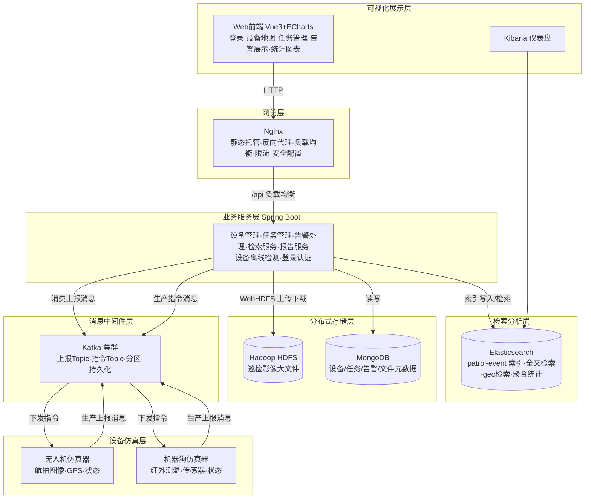
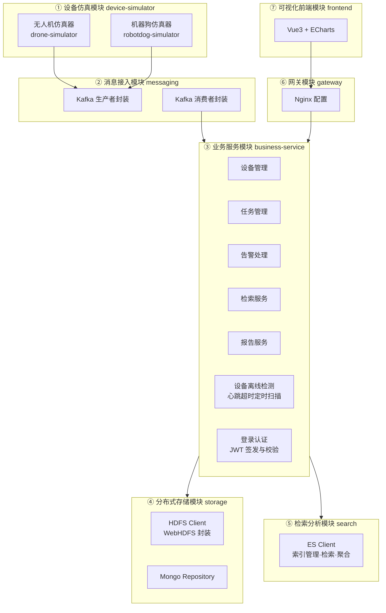
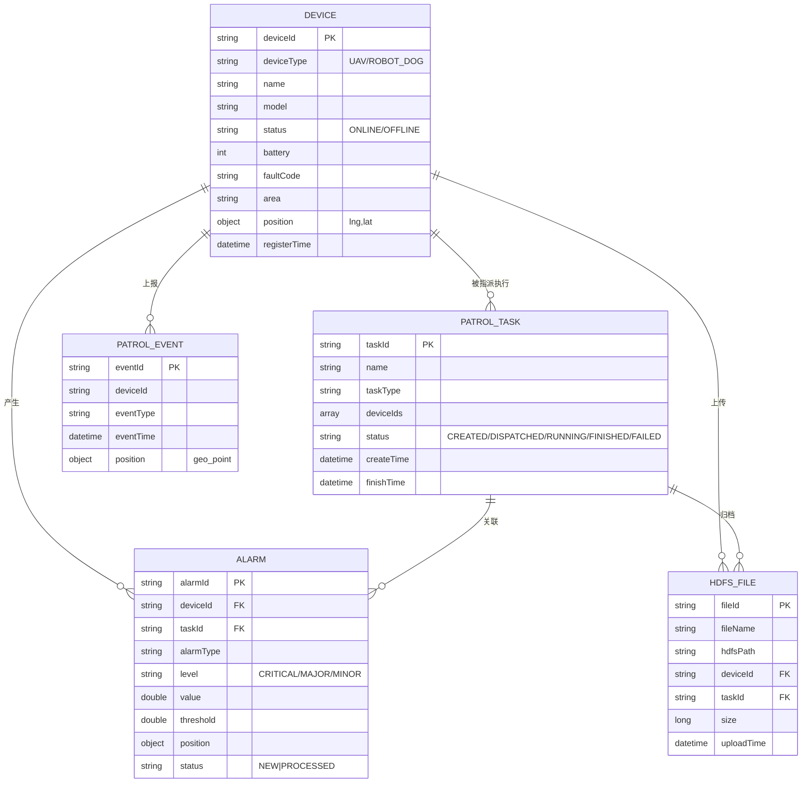
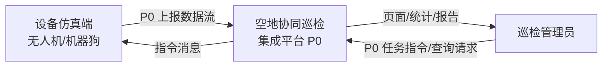
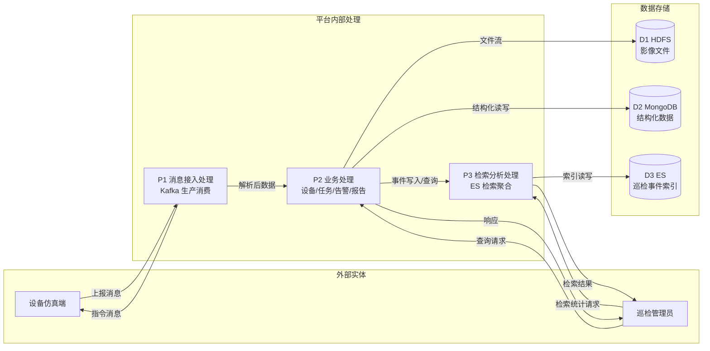
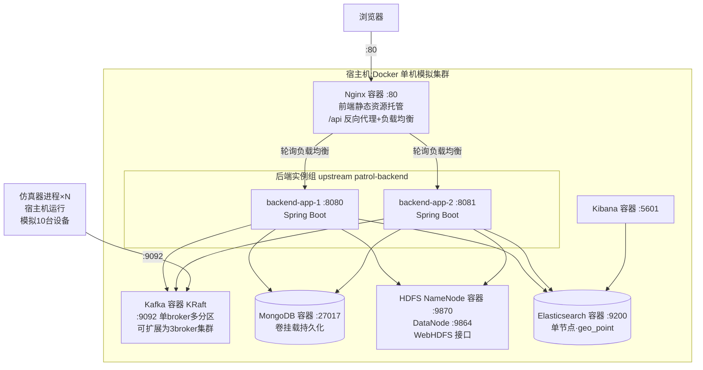

# 电力场站设备巡检数据集成平台 —— 系统架构设计文档

> 项目:无人机机器狗空地协同巡检集成平台(选题 2:电力场站设备巡检数据集成平台·进阶)
> 阶段:阶段一(需求分析与方案设计)产出物 3/3
> 版本:v1.1 修订(对照测试用例补齐:设备离线检测、文件上传/查询接口、登录认证)| 日期:2026-09-14
> 本文档结构与《企业应用开发实践课程设计报告》第 4 章"系统总体设计"保持一致。

---

## 1 系统设计原则

| 原则 | 落实方式 |
| --- | --- |
| 分层解耦 | 设备层/消息层/服务层/存储层/检索层/网关层/展示层职责单一,层间仅通过消息与接口交互 |
| 高内聚低耦合 | 设备端与业务服务通过 Kafka 完全解耦,业务服务无状态可水平扩展 |
| 数据分级存储 | 大文件走 HDFS、结构化数据走 MongoDB、检索分析走 ES,各取所长 |
| 可观测可维护 | 结构化日志、组件健康检查、统一配置外置 |
| 仿真真实性 | 仿真器按真实协议形态(JSON 消息 + Topic 路由)模拟,替换真实设备仅需更换数据源 |
| 工程规范 | 统一 Docker 镜像版本、Git 版本管理、代码规范与文档同步 |

## 2 系统总体架构设计(分层架构图)

系统按七层组织,数据流纵向贯穿:



各层职责说明:

| 层 | 组件 | 职责 |
| --- | --- | --- |
| 设备仿真层 | 无人机/机器狗仿真器(独立 Java 进程) | 模拟设备行为,作为消息生产者输出数据流,订阅指令 Topic |
| 消息中间件层 | Kafka(KRaft,单机模拟多分区) | 消息生产、消费、持久化、分区路由,解耦设备端与业务服务端 |
| 业务服务层 | Spring Boot 单体模块化服务(可双实例) | 任务解析、设备管理、告警处理、存储编排、检索服务、报告生成、设备离线检测、登录认证 |
| 分布式存储层 | HDFS + MongoDB | HDFS 存巡检图片大文件;MongoDB 存设备、任务、告警、文件元数据结构化数据 |
| 检索分析层 | Elasticsearch + Kibana | 巡检事件/告警全文检索、geo 地理检索、聚合统计分析、仪表盘 |
| 网关层 | Nginx | 前端静态资源托管、反向代理、双实例负载均衡、限流、安全配置 |
| 可视化展示层 | Vue3 + ECharts 前端 | 登录页、设备 GIS 位置、设备状态、巡检任务、告警列表、检索与统计结果展示 |

## 3 技术选型论证

### 3.1 消息中间件:Kafka(备选 RocketMQ)

| 对比维度 | Kafka | RocketMQ |
| --- | --- | --- |
| 吞吐量 | 百万级 TPS,日志/数据流场景业界标杆 | 十万级 TPS,企业业务消息足够 |
| 分区模型 | Topic-Partition 分区并行消费,按设备编号路由保序 | 队列模型,有序消息需额外配置 |
| 生态成熟度 | Spring Kafka 官方整合、资料与社区最丰富 | 国内资料多,Java 生态良好 |
| 部署运维 | KRaft 模式免 ZooKeeper,Docker 单容器即可运行 | 依赖 NameServer + Broker,组件稍多 |

**选型结论:Kafka。** 本平台核心负载是设备数据流上报(图像元数据、测温、传感器、心跳),高吞吐 + 分区并行的特点与场景天然匹配;KRaft 模式部署最简单,降低阶段二联调风险。

### 3.2 分布式数据库:MongoDB(备选 HBase)

| 对比维度 | MongoDB | HBase |
| --- | --- | --- |
| 数据模型 | 文档模型(BSON),设备/任务 JSON 直接映射,字段灵活 | 列族 + rowkey,需精心设计 rowkey 才能高效查询 |
| 查询能力 | 丰富查询语言、聚合管道、地理位置索引 | 仅 rowkey 与 scan,实时多维查询弱 |
| 部署依赖 | 单容器即用 | 强依赖 HDFS + ZooKeeper,组件链长、排错成本高 |
| 项目匹配 | 设备台账、任务记录、告警记录均为文档型结构化数据 | 本项目无超宽表/海量写入场景,优势无法发挥 |

**选型结论:MongoDB。** 本项目结构化数据为文档型且查询维度多,MongoDB 文档模型、查询与聚合能力、单容器部署的可靠性均优于 HBase;HBase 面向超大规模列式写入,在本仿真项目数据规模下无法体现优势且运维成本高。

### 3.3 分布式文件系统:HDFS

- 课程强制要求分布式文件系统;巡检影像为 200KB~数 MB 的大文件,符合 HDFS"大文件、一次写多次读"定位;
- 访问方式选 **WebHDFS REST API**(HTTP PUT/GET),避免 Hadoop Java 客户端与 NameNode 版本匹配问题,业务服务无需引入 Hadoop 依赖;
- HDFS 分块 + 副本机制提供容错,满足影像归档可靠性要求(单节点容器模拟,副本因子配置为 1,原理文档中说明)。

### 3.4 检索引擎:Elasticsearch + Kibana

- 倒排索引支撑按设备编号、告警类型、事件描述全文检索;
- `geo_point` 类型 + geo_distance/geo_bounding_box 实现地理检索,匹配"按地理位置检索"强制需求;
- terms/date_histogram/geo 聚合 + Kibana 仪表盘/ECharts 完成多维统计分析可视化;
- 版本选 ES 8.x,配合 Spring Data Elasticsearch 8.x,索引映射在初始化时显式创建。

### 3.5 网关:Nginx

- 轻量高性能,单进程即可承载本项目全部流量;
- upstream 双后端实例实现轮询负载均衡(强制需求);
- 内置 limit_req 限流、安全头、CORS 配置能力,无需额外组件。

### 3.6 应用技术栈

| 类别 | 选型 | 理由 |
| --- | --- | --- |
| 后端 | Java 17 + Spring Boot 3.2 | spring-kafka/spring-data-mongodb/spring-data-elasticsearch 官方整合,企业级主流 |
| 前端 | Vue3 + Vite + Element Plus + ECharts | 组件化开发、生态成熟,图表库满足统计可视化 |
| 仿真模块 | Java 独立进程(可多实例模拟多设备) | 与后端同语言降低协作成本,可直接复用消息序列化代码 |
| 容器编排 | Docker Compose | 统一镜像版本,一键起停全组件,规避版本兼容冲突 |
| 构建 | Maven + Git | 标准工程化 |

## 4 模块划分



| 模块 | 关键职责 | 对应强制需求 |
| --- | --- | --- |
| ① 设备仿真模块 | 无人机/机器狗数据仿真生成、注册/心跳/状态/图像/测温/传感器上报、指令消费与执行 | 设备仿真接入 |
| ② 消息接入模块 | Kafka 生产者/消费者统一封装、JSON 序列化、按设备编号分区、消费幂等 | 消息中间件流转 |
| ③ 业务服务模块 | 设备台账、任务下发与跟踪、告警规则判定与处置、检索与报告接口、心跳超时离线检测、登录认证 | 基础业务功能 |
| ④ 分布式存储模块 | HDFS 影像上传/下载/删除、MongoDB CRUD、文件元数据登记 | 分布式存储 |
| ⑤ 检索分析模块 | ES 索引初始化、检索查询、聚合统计、Kibana 对接 | 检索分析 |
| ⑥ 网关模块 | 静态托管、反代、双实例负载均衡、限流、安全配置 | Nginx 网关 |
| ⑦ 可视化前端模块 | 设备地图、状态大屏、任务管理、告警列表、统计图表、报告页面 | 可视化展示 |

## 5 消息中间件设计(Kafka Topic)

| Topic | 方向 | 生产者 | 消费者 | 分区键 | 说明 |
| --- | --- | --- | --- | --- | --- |
| patrol.device.register | 设备→平台 | 仿真器 | 业务服务 | deviceId | 设备注册 |
| patrol.device.heartbeat | 设备→平台 | 仿真器 | 业务服务 | deviceId | 心跳(5s 周期) |
| patrol.device.status | 设备→平台 | 仿真器 | 业务服务 | deviceId | 状态/电量/故障变化 |
| patrol.drone.image | 设备→平台 | 无人机仿真器 | 业务服务 | deviceId | 航拍图像元数据+图片 |
| patrol.dog.thermal | 设备→平台 | 机器狗仿真器 | 业务服务 | deviceId | 红外测温数据 |
| patrol.dog.sensor | 设备→平台 | 机器狗仿真器 | 业务服务 | deviceId | 环境传感器数据 |
| patrol.task.result | 设备→平台 | 仿真器 | 业务服务 | taskId | 任务执行结果 |
| patrol.task.command | 平台→设备 | 业务服务 | 仿真器 | deviceId | 任务指令下发 |

设计要点:

- 按 **deviceId** 分区:同一设备消息路由至同一分区,保证单设备消息有序;
- 上报消息保留策略:`retention.hours=24`(数据已落库/索引,消息层仅作缓冲与解耦);
- 消费者组 `patrol-backend-group`,enable.auto.commit=false + 手动提交,消费逻辑幂等(按 msgId 去重);
- 消息 JSON 序列化,信封格式见《需求分析文档》6.1 节;
- 设备离线检测:业务服务内置定时扫描(如 @Scheduled 周期 5s),`device.lastHeartbeat` 超过 3 个心跳周期未更新即置 OFFLINE,并产生离线告警(写 Mongo + ES,对应测试用例 TC-010)。

## 6 数据模型设计

### 6.1 概念数据模型(ER 图)



### 6.2 MongoDB 集合设计

**device(设备台账)**

```json
{
  "_id": "UAV-001",
  "deviceType": "UAV",
  "name": "无人机1号",
  "model": "巡检无人机-M300",
  "area": "1号变电站·东区",
  "status": "ONLINE",
  "battery": 87,
  "faultCode": "",
  "position": { "lng": 116.397, "lat": 39.908 },
  "lastHeartbeat": "2026-09-11T10:30:05+08:00",
  "registerTime": "2026-09-11T09:00:00+08:00"
}
```

**patrol_task(巡检任务)**

```json
{
  "_id": "T-002",
  "name": "2号主变压器红外测温",
  "taskType": "THERMAL",
  "area": "1号变电站·东区",
  "deviceIds": ["ROBOTDOG-002"],
  "status": "FINISHED",
  "createTime": "2026-09-11T10:00:00+08:00",
  "dispatchTime": "2026-09-11T10:00:03+08:00",
  "finishTime": "2026-09-11T10:45:00+08:00",
  "result": { "pointCount": 12, "alarmCount": 1, "detail": "测温点位12个,采集完成" }
}
```

**alarm(告警记录)**

```json
{
  "_id": "A-001",
  "deviceId": "ROBOTDOG-002",
  "taskId": "T-002",
  "alarmType": "TEMP_OVER",
  "level": "CRITICAL",
  "value": 92.3,
  "threshold": 80.0,
  "position": { "lng": 116.398, "lat": 39.909 },
  "description": "2号主变压器热点温度92.3℃,超过严重阈值80℃",
  "status": "PROCESSED",
  "createTime": "2026-09-11T10:32:00+08:00",
  "processTime": "2026-09-11T11:00:00+08:00",
  "processNote": "已通知检修班组现场复核"
}
```

**hdfs_file(文件元数据)**

```json
{
  "_id": "img-xxx",
  "fileName": "UAV-001_20260911_103000.jpg",
  "hdfsPath": "/patrol/1号变电站/2026-09-11/UAV-001/img-xxx.jpg",
  "deviceId": "UAV-001",
  "taskId": "T-001",
  "fileSize": 204800,
  "uploadTime": "2026-09-11T10:30:00+08:00"
}
```

### 6.3 Elasticsearch 索引设计(patrol-event)

```jsonc
{
  "mappings": {
    "properties": {
      "eventId":    { "type": "keyword" },
      "deviceId":   { "type": "keyword" },
      "deviceType": { "type": "keyword" },
      "deviceName": { "type": "keyword" },
      "eventType":  { "type": "keyword" },   // IMAGE | THERMAL | SENSOR | ALARM
      "alarmType":  { "type": "keyword" },   // TEMP_OVER | BATTERY_LOW | OFFLINE | FAULT
      "alarmLevel": { "type": "keyword" },   // CRITICAL | MAJOR | MINOR
      "taskId":     { "type": "keyword" },
      "area":       { "type": "keyword" },
      "temperature":{ "type": "double" },
      "threshold":  { "type": "double" },
      "position":   { "type": "geo_point" },
      "eventTime":  { "type": "date", "format": "yyyy-MM-dd'T'HH:mm:ssXXX" },
      "description":{ "type": "text", "analyzer": "ik_max_word" }
    }
  },
  "settings": { "number_of_shards": 1, "number_of_replicas": 0 }
}
```

设计要点:检索维度字段全部 keyword 精确匹配;描述字段 ik 分词支持全文检索;position geo_point 支撑地理半径/矩形检索;单节点部署分片 1 副本 0,压测扩展说明写入文档。

## 7 核心数据流图(DFD)

### 7.1 顶层数据流图



### 7.2 0 层数据流图



## 8 接口设计(REST API)

统一前缀 `/api`,经 Nginx 转发至后端 upstream;响应统一 JSON 信封 `{ "code": 0, "msg": "ok", "data": {} }`。

| 方法 | 路径 | 说明 |
| --- | --- | --- |
| POST | /api/auth/login | 登录(账号密码,签发 JWT;除健康检查外受保护接口统一鉴权) |
| GET | /api/devices | 设备台账列表(支持状态/类型/区域筛选) |
| POST | /api/devices | 新增设备 |
| PUT | /api/devices/{id} | 更新设备(区域/名称等) |
| DELETE | /api/devices/{id} | 删除设备 |
| GET | /api/devices/{id} | 设备详情(含最近心跳/状态) |
| POST | /api/tasks | 创建并下发巡检任务(写 Mongo + 发 Kafka 指令) |
| GET | /api/tasks?status=&type=&page= | 任务分页查询(历史任务) |
| GET | /api/tasks/{id} | 任务详情与执行进度 |
| GET | /api/alarms?level=&type=&status=&page= | 告警分页筛选列表 |
| GET | /api/alarms/{id} | 告警详情 |
| PUT | /api/alarms/{id}/process | 告警处置(标记已处理 + 备注) |
| POST | /api/search/events | 巡检事件检索(设备/时间/类型/geo 条件,JSON 请求体) |
| GET | /api/search/stats?from=&to= | 聚合统计(告警类型分布/设备排行/时间趋势/区域分布) |
| POST | /api/reports | 生成指定时间段巡检报告 |
| POST | /api/files | 上传巡检图片(写 HDFS + 登记 Mongo 文件元数据) |
| GET | /api/files?deviceId=&taskId= | 文件元信息查询列表 |
| GET | /api/files/{fileId}/download | 影像文件下载(经 HDFS 获取) |
| GET | /api/health | 健康检查(供 Nginx/运维使用) |

## 9 部署方案设计(Docker 集群部署拓扑图)

单机 Docker 多容器模拟分布式集群,后端双实例演示 Nginx 负载均衡:



部署要点:

- 全部组件固定镜像版本,`docker-compose.yml` 一键编排,数据目录卷挂载宿主机保证容器重建不丢数据;
- Kafka 采用 KRaft 模式(免 ZooKeeper),起步单 broker 多分区,文档说明扩展 3 broker 方式;
- HDFS 为单 NameNode + 单 DataNode 容器(副本因子 1),WebHDFS 端口 9870;
- 后端两实例镜像相同,仅端口与实例名不同,验证 Nginx upstream 轮询与单实例故障转移;
- 仿真器作为普通 Java 进程运行于宿主机(或独立容器),通过启动参数配置设备编号与数量,实现多设备并发模拟。

## 10 安全设计(网关层)

| 措施 | 配置要点 |
| --- | --- |
| 隐藏版本信息 | `server_tokens off;` |
| 请求体限制 | `client_max_body_size 20m;`(影像上传上限) |
| 防目录遍历/越权路径 | 静态资源 root 精确配置,禁止路径回溯 |
| CORS 白名单 | 仅允许前端同源访问,统一入口消除跨域 |
| 接口限流 | 检索接口 `limit_req_zone` 10r/s,防恶意查询打满 ES |
| 超时与连接控制 | proxy 超时、连接复用参数调优 |
| 认证 | 后端 JWT 简单登录(登录页 + 令牌签发/校验),受保护接口统一鉴权,前端路由守卫 |

## 11 关键风险与应对

| 风险 | 应对 |
| --- | --- |
| ES geo 查询报类型错误 | 显式创建索引 mapping,position 定义为 geo_point,写入用 `{lat,lon}` 格式 |
| Kafka 消费丢消息/重复 | 手动提交 offset + msgId 幂等去重(Redis/内存 Set + Mongo 唯一索引兜底) |
| WebHDFS 上传 403 | 检查 `dfs.webhdfs.enabled` 与用户代理配置,使用简单用户认证 |
| Spring Boot 与 ES 8.x 版本冲突 | 锁定 spring-data-elasticsearch 与 ES 镜像同大版本 |
| 双实例负载均衡验证困难 | Nginx access log 打印 upstream 实例名,前端健康页展示命中的实例 |
| 单机资源不足 | 限制 ES 堆内存(512m)、Kafka 分区与保留时间,仿真图片体积控制在 200KB |

---

> 本初稿待小组评审后定稿;架构调整须同步更新本文件与需求文档。
